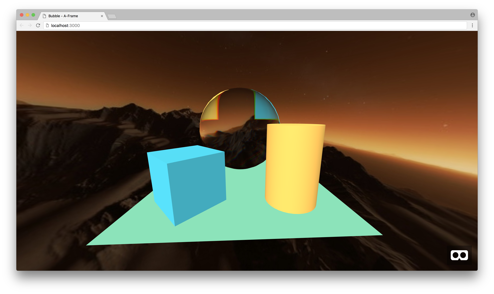

# A-Frame Bubble

Bubble component for [A-Frame](https://aframe.io) to add on any entities.

## Demo



#### [Live demo](https://etiennepinchon.github.io/aframe-bubble/)

## Getting Started

```
<a-entity bubble></entity>
```

To turn it off:

```
<a-entity bubble="enabled:false"></entity>
```

## Want to make some changes to it?

### Installation

First make sure you have Node installed.

On Mac OS X, it's recommended to use [Homebrew](http://brew.sh/) to install Node + [npm](https://www.npmjs.com):

    brew install node

To install the Node dependencies:

    npm install


### Local Development

To serve the site from a simple Node development server:

    npm start

Then launch the site from your favourite browser:

[__http://localhost:3000/__](http://localhost:3000/)

If you wish to serve the site from a different port:

    PORT=8000 npm start


## Acknowledgement

Based on the work of @stemkoski for ThreeJS:
http://stemkoski.github.io/Three.js/Bubble.html

## License

Distributed under an [MIT License](LICENSE).
